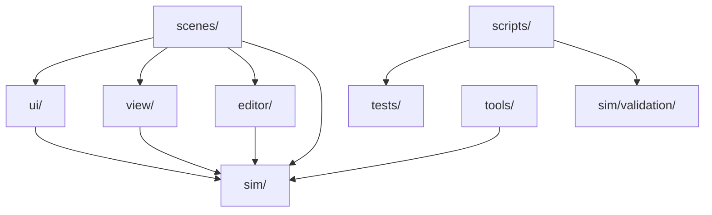

# Dependency Audit

Date: 2026-06-17.

This is a static, documentation-only audit of high-level dependencies observed through project structure, `preload()` references, scripts and documentation. It does not enforce rules.

## Expected Dependency Direction

## Observations

- `Main.gd` bridges simulation scene nodes, HUD, 2D/3D views and first-person mode.
- `editor/ScenarioEditor.gd` depends on editor helpers, runtime templates, building model helpers and preview visualizers.
- `view/3d/Visualizer3D.gd` and `view/fp/FirstPersonController.gd` preload many visual helpers and consume building/state data.
- `sim/core/SimulationEngine.gd` preloads core systems and acts as the main runtime orchestrator.
- `scripts/` contains official command entrypoints and should remain independent of user-specific absolute paths where possible.
- `tools/` contains Godot validation scenes and technical utilities that intentionally exercise runtime internals.

## Risks

- Large files blur dependency boundaries because one file owns too many responsibilities.
- Views can be tempted to read internal model details directly instead of consuming state snapshots.
- Editor preview code can drift into runtime visualizer responsibilities.
- Validation scripts and reports can accidentally depend on moved documentation paths.

## Recommendations

- Use `docs/architecture/MODULE_BOUNDARIES.md` during reviews.
- Keep new official commands documented in `docs/COMMANDS.md`.
- Prefer extracting view helpers before adding new behavior to `Visualizer3D.gd` or `FirstPersonController.gd`.
- Prefer extracting editor helper classes before adding new behavior to `ScenarioEditor.gd`.
- Keep validation-lane checks separate from product/editor checks.
