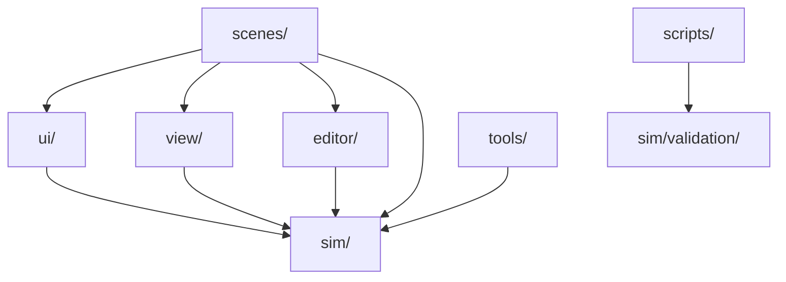

# Module Boundaries

This document describes the intended boundaries between major SimuFire areas. It is guidance for future refactors and reviews; it does not describe a currently enforced import rule system.

## Layers

## `sim/`

Owns simulation domain logic:

- building and room models;
- fire, gas, thermal, oxygen, HVAC, smoke, glass and spread systems;
- validation cases, baselines and scientific reports.

Expected dependencies:

- may use Godot primitives and resources;
- should not depend on editor UI implementation;
- should not depend on HUD or visualizer internals;
- should expose state through stable builders or model APIs.

## `editor/`

Owns authoring workflows:

- interactive scenario editing;
- object library;
- editor grid and drawing helpers;
- serialization from editor data to runtime template data.

Expected dependencies:

- may depend on `sim/templates` and model validation helpers;
- may create preview visualizers when needed;
- should not embed simulation physics changes;
- should not write generated artifacts to the repo root.

## `view/`

Owns runtime presentation:

- 2D view;
- 3D view;
- first-person mode;
- furniture and visual helpers.

Expected dependencies:

- may consume `BuildingModel` and state snapshots;
- should avoid mutating simulation physics directly;
- should route user intent back through explicit signals or controller methods.

## `ui/`

Owns HUD and UI helpers:

- playback controls;
- room/opening/victim panels;
- localization;
- theme.

Expected dependencies:

- may consume display-ready state;
- should not duplicate simulation formulas;
- should avoid hardcoded scenario or validation paths.

## `scripts/`

Owns official command-line entrypoints:

- product checks;
- scenario runs;
- graph generation;
- documentation checks;
- local cleanup.

Expected dependencies:

- must resolve paths from the repository root;
- should prefer arguments over hardcoded user paths;
- should be documented in `docs/COMMANDS.md` when public.

## `tools/`

Owns validators and technical utilities:

- Godot headless validation scenes;
- 3D/FP/editor smoke validators;
- technical audit helpers.

Expected dependencies:

- may exercise product internals;
- should keep generated output outside the repo root;
- should move obsolete experiments to `tools/archive/`.

## Boundary Review Checklist

- Does this change introduce a new cross-folder dependency?
- Is the dependency direction consistent with this document?
- Could this helper live closer to the domain it serves?
- Is this a runtime behavior change or only presentation/tooling?
- Does a public command or document need updating?
