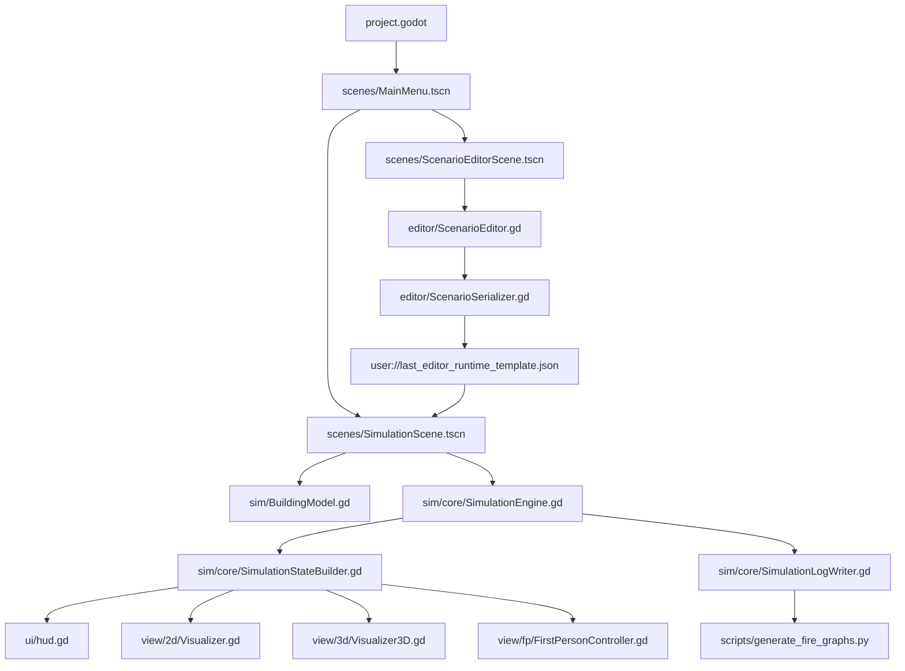
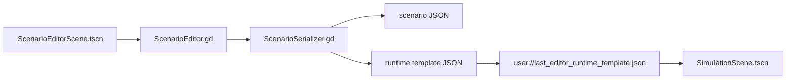
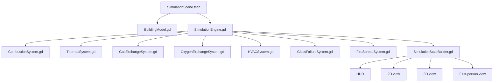
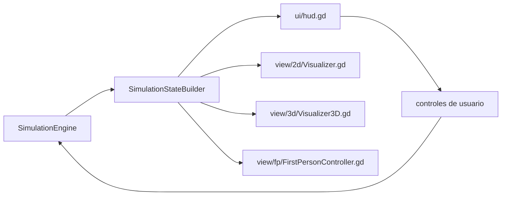
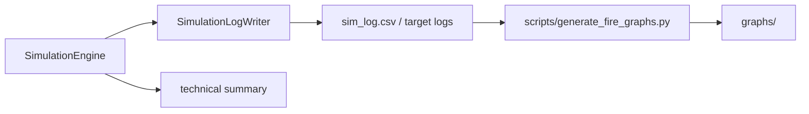
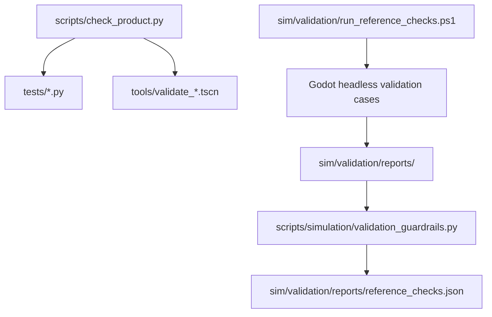

# SimuFire Program Flow

Este documento resume cómo se conecta el programa a nivel de producto. No describe todos los detalles físicos del motor; sirve como mapa de orientación para desarrollo, revisión y mantenimiento.

## Vista General

## Arranque

Godot entra por `project.godot`, que define `res://scenes/MainMenu.tscn` como escena principal. El menú permite iniciar una simulación directa o abrir el editor de escenarios.

Responsables principales:

- `project.godot`: configuración de aplicación, render, ventana y escena principal.
- `scenes/MainMenu.tscn`: escena inicial.
- `scenes/MainMenu.gd`: lógica de selección inicial, opciones de arranque y navegación.

## Flujo del Editor

El editor crea o modifica escenarios visuales. Su salida importante no es una escena Godot, sino datos serializados que luego el runtime puede cargar.

Flujo:

Responsables principales:

- `editor/ScenarioEditor.gd`: interacción del editor, herramientas, selección, propiedades, dibujo y export runtime.
- `editor/ScenarioSerializer.gd`: normalización, validación básica y conversión a formato runtime.
- `editor/ObjectLibrary.gd`: catálogo de objetos disponibles para el editor.
- `editor/EditorGrid.gd` y `editor/EditorDraw2D.gd`: soporte visual del editor.

## Flujo de Simulación

La escena de simulación carga el modelo del edificio, configura el motor y distribuye el estado a HUD y vistas.

Responsables principales:

- `sim/BuildingModel.gd`: geometría, habitaciones, aperturas, objetos, víctimas, detectores y datos HVAC.
- `sim/core/SimulationEngine.gd`: orquestación del paso de simulación.
- `sim/core/*System.gd`: subsistemas físicos o técnicos concretos.
- `sim/fire/*`: modelo de fuego y objetos combustibles.
- `sim/building/*`: modelos base de habitaciones y aperturas.
- `sim/smoke/SmokeModel.gd`: modelo auxiliar de humo/visibilidad.

## Flujo de Estado y Vistas

El runtime no debería obligar a las vistas a leer detalles internos del motor. El punto de salida principal es el estado construido por `SimulationStateBuilder`.

Responsables principales:

- `ui/hud.gd`: controles, paneles de estado, interacción con aperturas y navegación de modo.
- `view/2d/Visualizer.gd`: representación 2D del plano y estados por sala.
- `view/3d/Visualizer3D.gd`: reconstrucción y actualización de escena 3D.
- `view/fp/FirstPersonController.gd`: modo primera persona, movimiento, interacción y overlay FP.
- `ui/UILocalization.gd`: textos localizados de UI.

## Flujo de Logs, Export y Gráficas

La simulación puede escribir logs y CSVs. Los scripts externos consumen esas salidas para crear gráficas o informes.

Responsables principales:

- `sim/core/SimulationLogWriter.gd`: logs de simulación.
- `scripts/generate_fire_graphs.py`: gráficas a partir de resultados.
- `scripts/run_scenario.py`: ejecución headless de escenarios.
- `graphs/` y `runs/`: salidas locales ignoradas por Git.

## Flujo de Validación

SimuFire separa validación de producto/editor y validación científica.

Carriles:

- Producto/editor: `python scripts/check_product.py`.
- Guardrails científicos rápidos: `python scripts/simulation/validation_guardrails.py`.
- Suite científica fresca: `sim/validation/run_reference_checks.ps1`.
- Two-Zone V1: `sim/validation/run_two_zone_v1_checks.ps1`.

## Responsabilidades por Carpeta

| Carpeta | Responsabilidad |
|---|---|
| `assets/` | Recursos visuales, fuentes, sprites, escenas de mobiliario y assets del producto |
| `docs/` | Documentación, arquitectura, auditorías, validación, bibliografía e histórico |
| `editor/` | Editor de escenarios y serialización desde editor a runtime |
| `external/` | Comparaciones o material técnico externo al runtime principal |
| `i18n/` | Textos localizados |
| `scenarios/` | Escenarios de referencia de usuario/producto |
| `scenes/` | Escenas Godot principales |
| `scripts/` | Comandos oficiales de consola |
| `sim/` | Motor de simulación, modelos, validación científica y templates |
| `tests/` | Tests Python |
| `tools/` | Validadores, escenas headless y utilidades técnicas |
| `truth/` | Datos de verdad o referencia |
| `ui/` | HUD, tema, localización y componentes de interfaz |
| `view/` | Visualizadores 2D, 3D y first-person |

## Zonas de Mayor Riesgo de Mantenimiento

Estas áreas funcionan como piezas centrales, pero hoy concentran muchas responsabilidades:

- `editor/ScenarioEditor.gd`
- `view/fp/FirstPersonController.gd`
- `view/3d/Visualizer3D.gd`
- `sim/core/SimulationEngine.gd`
- `sim/core/ThermalSystem.gd`

Antes de añadir comportamiento grande en esas zonas, conviene valorar si la nueva responsabilidad puede entrar en un helper, componente o sistema dedicado.
